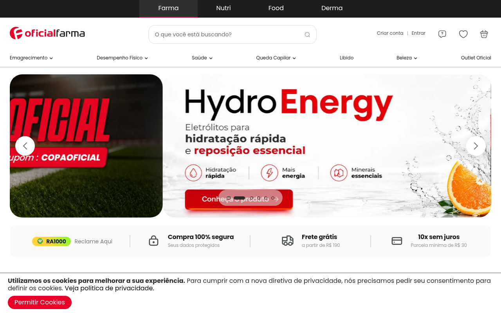
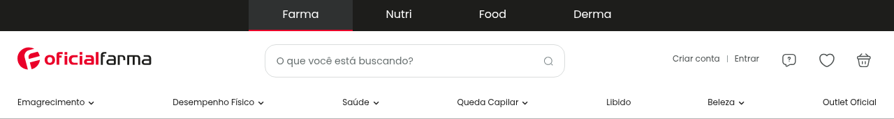
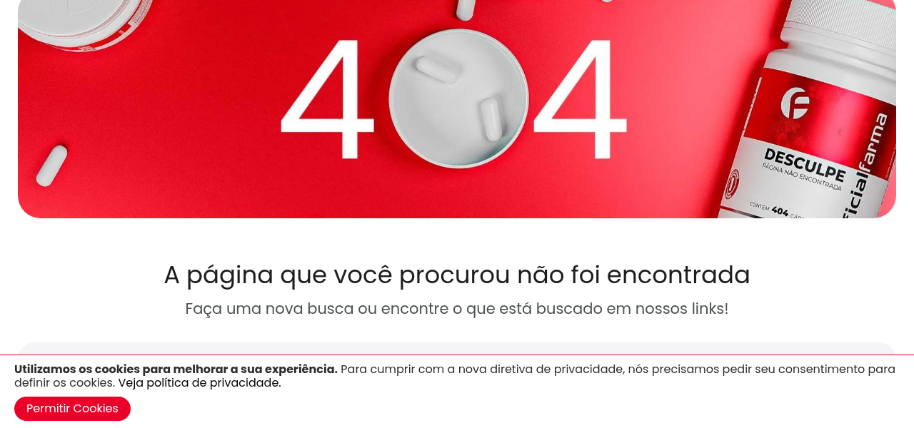

# Relato dos Resultados da Avaliação

## 1. Introdução

Este documento apresenta o relato formal dos resultados obtidos a partir da Avaliação de Acessibilidade e Usabilidade realizada no e-commerce **OficialFarma**. A inspeção seguiu os moldes definidos no **Planejamento da Avaliação** e confrontou a interface pública e a marcação técnica do site com as diretrizes compiladas no nosso Guia de Acessibilidade Digital.

- **Site Avaliado:** OficialFarma (https://www.oficialfarma.com.br/)
- **Metodologia:** Inspeção por Checklists (Gestão, Design, Desenvolvimento, Conteúdo)
- **Avaliadores:** Jonas e IA Assistente
- **Escopo Percorrido:** Home Page, Busca Global, Mega Menu de Categorias, e Página Detalhada de Produto.

## 2. Metodologia de Classificação

Para cada critério listado em nossos checklists, aplicou-se a seguinte classificação:
* <span class="badge-status badge-c">C</span> **Conforme:** O site OficialFarma atende plenamente ao critério.
* <span class="badge-status badge-p">P</span> **Parcialmente Conforme:** O site OficialFarma atende em parte, mas com ressalvas críticas de aplicação ou código.
* <span class="badge-status badge-nc">NC</span> **Não Conforme:** O site OficialFarma viola o critério de acessibilidade.
* <span class="badge-status badge-na">NA</span> **Não Aplicável:** O critério não se aplica ao escopo atual avaliado (ex: processos internos).

---

## 3. Resultados da Inspeção (Checklists)

### 3.1. Gestão de Projetos
Esta seção avalia a conformidade macro e as políticas de acessibilidade expostas pelo e-commerce.

| Diretriz / Critério do Checklist | Status | Evidência / Observação |
| :--- | :---: | :--- |
| **Considerar acessibilidade desde a iniciação** | <span class="badge-status badge-na">NA</span> | Critério de processo interno da OficialFarma. |
| **Aplicar princípios de Desenho Universal** | <span class="badge-status badge-p">P</span> | O site tem visual moderno para vários dispositivos, mas erra em não estender essa universalidade para usuários com limitações visuais. |
| **Conformidade com a legislação (LBI Art. 63 / ABNT NBR 17225)** | <span class="badge-status badge-nc">NC</span> | O site OficialFarma viola o Art. 63 da Lei Brasileira de Inclusão, pois mantém barreiras críticas de acesso em suas páginas públicas, impossibilitando autonomia. |
*(Nota: Itens unicamente internos como documentação e cronograma interno foram suprimidos do relato público por serem avaliados como NA).*

### 3.2. Design
Avaliação dos aspectos visuais, contraste, responsividade e affordance.

| Diretriz / Critério do Checklist | Status | Evidência / Observação |
| :--- | :---: | :--- |
| **Garantir um indicador de foco visível (Tab)** | <span class="badge-status badge-nc">NC</span> | O site desativa o contorno nativo de foco do navegador (`outline: none`), impedindo a navegação visual pelo teclado. |
| **Garantir contraste de texto (mínimo 4.5:1)** | <span class="badge-status badge-c">C</span> | A paleta de cores (texto escuro, botões verdes) atende perfeitamente ao contraste mínimo exigido. |
| **Links distinguíveis visualmente** | <span class="badge-status badge-p">P</span> | No rodapé, os links distinguem-se visualmente do texto apenas pela cor sutil, sem sublinhado padrão. |
| **Garantir design responsivo** | <span class="badge-status badge-c">C</span> | O layout flui de forma adaptativa no mobile, organizando-se em coluna única. |
| **Garantir área clicável mínima de 44x44px** | <span class="badge-status badge-nc">NC</span> | Os botões de quantidade (`+` e `-`) e vários links no rodapé têm área de toque muito inferior a 44x44px. |
| **Informar ao usuário sua localização** | <span class="badge-status badge-c">C</span> | Uso excelente de "breadcrumbs" situando o usuário na categoria correta. |
| **Design estético e minimalista** | <span class="badge-status badge-p">P</span> | O excesso de pop-ups intrusivos e banners polui visualmente a experiência (Heurística 8). |

### 3.3. Desenvolvimento
Avaliação técnica da estrutura do código HTML, semântica e navegação por teclado.

| Diretriz / Critério do Checklist | Status | Evidência / Observação |
| :--- | :---: | :--- |
| **Usar elementos HTML nativos** | <span class="badge-status badge-p">P</span> | Erros de tags: botão do carrinho é um `<button href="...">` e links do rodapé usam `href="#"`. |
| **Garantir navegação por teclado (Tab/Setas)** | <span class="badge-status badge-nc">NC</span> | O menu suspenso de categorias ("Mega Menu") abre APENAS com o mouse (`hover`), bloqueando o usuário de teclado de expandir os submenus. |
| **Garantir a tag `<label>` para todos os campos** | <span class="badge-status badge-nc">NC</span> | O campo principal de Busca e input de Frete (CEP) não contam com `<label>` associado programaticamente (`for`). |
| **Adicionar link "Pular para o conteúdo"** | <span class="badge-status badge-nc">NC</span> | Ausente na raíz do site. Força travessia lenta pelo teclado. |
| **Disponibilizar campo de busca acessível** | <span class="badge-status badge-nc">NC</span> | O botão de lupa da busca não traz texto acessível (anuncia apenas "botão"). |
| **Informar quando o link abre em nova guia** | <span class="badge-status badge-nc">NC</span> | Banners no rodapé abrem novas guias sem emitir aviso de áudio. |
| **Avisar mudanças dinâmicas (`aria-live`)** | <span class="badge-status badge-nc">NC</span> | A atualização do carrinho ocorre de forma silenciosa para o leitor de tela. |

### 3.4. Conteúdo
Avaliação da clareza, links, alts de imagem e rotulação textual.

| Diretriz / Critério do Checklist | Status | Evidência / Observação |
| :--- | :---: | :--- |
| **Usar linguagem simples, clara e direta** | <span class="badge-status badge-c">C</span> | A linguagem geral é de fácil compreensão. |
| **Garantir o uso Semântico de Títulos (H1-H6)** | <span class="badge-status badge-c">C</span> | A hierarquia textual é respeitada de forma lógica. |
| **Evitar abreviações ou jargões** | <span class="badge-status badge-p">P</span> | Uso intenso de jargões técnicos farmacêuticos sem um glossário atrelado. |
| **Textos alternativos (`alt`) em imagens** | <span class="badge-status badge-nc">NC</span> | **Falha Crítica:** A maior parte das imagens de produtos e banners promocionais carecem do atributo `alt`, deixando cegos sem saber o produto visualizado. |
| **Evitar texto dentro de imagens** | <span class="badge-status badge-nc">NC</span> | Banners de ofertas usam textos e cupons de desconto desenhados na própria imagem. |
| **Garantir Nomes de Links Únicos e Claros** | <span class="badge-status badge-nc">NC</span> | Vários links chamados apenas de "Comprar" repetidamente, o que se torna incompreensível fora de contexto no leitor de telas. |

---

## 4. Diagnóstico e Propostas de Intervenção

Através da tabulação dos resultados, identificamos três violações críticas que necessitam de intervenção urgente de desenvolvimento e design. Abaixo catalogamos os problemas encontrados e sugerimos a solução técnica.

### 🔴 Problema 1: Imagens sem Alternativa Textual (WCAG 1.1.1 - Nível A)
* **Descrição do Problema:** A ausência de atributo `alt` nas fotos de produtos e banners na vitrine impede que usuários de tecnologias assistivas descubram qual medicamento está sendo vendido.
* **Evidência Visual:**
  
* **Sugestão de Intervenção (HTML):**
  A aplicação deve injetar dinamicamente o título do produto no atributo da imagem.
  ```html
  <!-- Forma Incorreta atual -->
  
  
  <!-- Intervenção Sugerida -->
  
  ```

### 🔴 Problema 2: Teclado sem Foco e Menu Suspenso Bloqueado (WCAG 2.4.7 e 2.1.1 - Nível A)
* **Descrição do Problema:** O site remove o foco visual do teclado via CSS (`outline: none;`). Pior ainda, o menu de departamentos (Mega Menu) só se abre ao passar o mouse, impossibilitando que alguém sem mouse navegue até as categorias internas do site.
* **Evidência Visual:**
  
* **Sugestão de Intervenção (CSS & JS):**
  Restaurar o indicador de foco de estado global e refatorar o JavaScript para disparar o menu ao receber foco do DOM.
  ```css
  /* Intervenção CSS */
  a:focus, button:focus, input:focus {
      outline: 3px solid #1b5e20;
      outline-offset: 2px;
  }
  ```

### 🔴 Problema 3: Inputs sem Rótulo (Label) Semântico (WCAG 4.1.2 - Nível A)
* **Descrição do Problema:** Os botões de + e - no carrinho e o input da barra de pesquisa global não tem texto embutido nem `aria-label`, sendo lidos de forma vazia pelo NVDA/VoiceOver.
* **Evidência Visual:**
  
* **Sugestão de Intervenção (HTML):**
  ```html
  <!-- Intervenção Sugerida para Controle Numérico -->
  <button aria-label="Diminuir quantidade em uma unidade">-</button>
  <button aria-label="Aumentar quantidade em uma unidade">+</button>
  ```

## 5. Conclusão

A avaliação aponta que a OficialFarma possui um frontend responsivo e atraente, atendendo a critérios superficiais de design responsivo e contraste. No entanto, o sistema falha drasticamente no quesito da acessibilidade estrutural e semântica. 

As violações encontradas na navegação por teclado e na rotulação de imagens tornam o fluxo de compra quase inviável para pessoas com deficiências severas (motoras e visuais), evidenciando não conformidade com a legislação brasileira (Art. 63 da LBI). Recomenda-se a priorização imediata das intervenções sugeridas para adequação aos níveis mínimos A e AA da norma WCAG 2.2.
